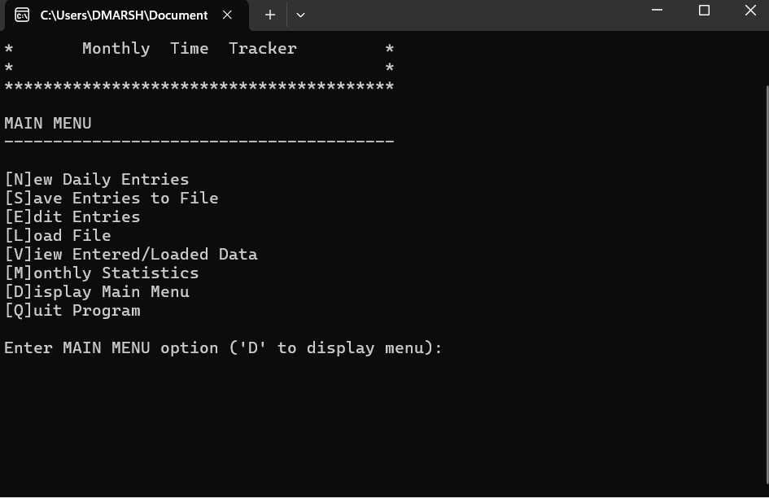
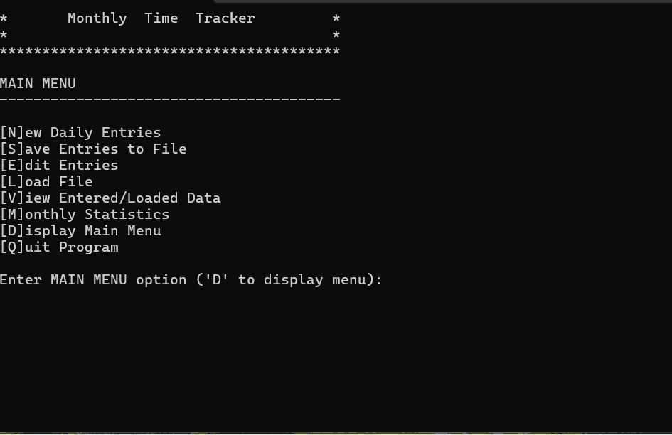

# WINTER 2025 Assignment 03 - Methods, Arrays, and File I/O
__Weight:__ 15% of final mark

__Submission requirements:__ On or before the deadline, commit a Visual Studio 2022 project to the GitHub repository. __You must commit and push to the classroom repository supplied for the assignment__; do not create your own repository. It is your responsibility to ensure that your work is in the correct repository. ___Work not in the repository will not be graded___.

## Context
As a busy student, you are interested in learning how much time you are spending studying and working on homework each day. You decide to build a program that could produce some basic stats for you to review, such as your average time spent studying each day, and your highest and lowest days.

### Requirements

Your program must meet the following requirements:

- Must allow the user to **enter** the minutes spent studying per day
- Must allow the user to **save** their entered daily values to a file
- Must allow the user to **load** a previously saved data file
- Must allow the user to **view** and **edit** previously entered values
- Must allow the user to view simple **analysis** of the currently entered/loaded data:
  - Average minutes
  - Highest daily amount
  - Lowest daily amount
  - Chart of daily values for the current month

## Implementation Details 

You will be provided with a starter project for this assignment ([Assignment3StarterCode](./Assignment3/)). Your job will 
be to complete the missing requirements where indicated. There are a number of tasks that are all identified by 
`// TODO: ` comments throughout the `Program.cs` file.

Your solution must look and behave like the sample gifs you have been provided.

The program makes use of a main menu for top-level options and a sub-menu for the analysis options. The program should continue to run until the user chooses to quit the program. Ask the user to supply the desired filename when saving a new monthly file. The filename must end with .csv or .txt and not be empty. If the filename entered does not end in .csv or .txt then have it default to .csv.  When entering new daily data, the user will need to enter new values for one month only and provide a value for each day in the month (days with no time spent studying will be recorded as zero); there is no requirement for appending values into already partially filled arrays.  The user will be prompted for the month and the year. The prompt for each day should state what day (day 01, day 02, etc..) that the user is entering data for. Ensure that date values are in valid YYYY-MMM-DD (e.g., 2025-FEB-05) format and that values are zero or positive. Day numbers are to be display as 2 digits.

Use two parallel arrays for storing the data in your program (one for date values and one for corresponding daily values). Keep an accurate record count for the number of days of data that have been loaded/entered.

Ensure that duplicate entry dates (when entering data) are not allowed; there should only be one value per date.

The format of the data files should be as follows (you may assume valid file format for input):
- Include a header record with the following headings: Date and Minutes
- Minutes results are recorded to two decimal places
- Data files must include the date in YYYY-MMM-DD format and be ordered in ascending date order:

```sh
Date,Minutes
2025-FEB-01,180.25
2025-FEB-02,0.00
2025-FEB-03,45.00
2025-FEB-04,60.50
... (additional rows left out to save space)
2025-FEB-29,123.45
```
_Excerpt of sample data file format_

You will use a **modular** approach when constructing this program. Ensure that, at a minimum, the following methods are present and used (difficulty level is rated 1-easy, 2-moderate, 3-challenging, 4-extreme):

- `void DisplayMainMenu()` --> displays the main menu options [difficulty 1]
- `void DisplayAnalysisMenu()` --> displays the analysis menu options [difficulty 1]
- `string Prompt(string promptMessage)` --> displays the prompt message and returns user-entered string (allow empty string to be returned) [difficulty 1]
- `double PromptDouble(string promptMessage)` --> displays the prompt message and returns user-entered `double` (ensure that the program does not crash and **always** returns a valid double value) [difficulty 1]
- `double CalculateLargest(double[] values, int countOfEntries)` --> returns the value of the _highest_ amount in the values array
(requires that the original ordering of the arrays be retained) [difficulty 1]
- `double CalculateSmallest(double[] values, int countOfEntries)` --> returns the value of the _lowest_ amount in the values array
(requires that the original ordering of the arrays be retained) [difficulty 1]
- `double CalculateMean(double[] values, int countOfEntries)` --> returns the mean average of the _daily_ values; include all days for the month (yes, even days with zero minutes) [difficulty 1]
- `int EnterDailyValues(string[] dates, double[] values)` --> allows the user to enter dailys values entries (dates and values values) into the arrays; returns the number of entries entered [difficulty 2]
- `int LoadFromFile(string filename, string[] dates, double[] values)` --> loads the records from a file
(filename) into the associative arrays used by the program; returns the record count (i.e. how
many days of data were loaded) [difficulty 2]
- `void SaveToFile(string filename, string[] dates, double[] values, int countOfEntries)` --> writes the
associative array data to a file (filename) in the correct format [difficulty 2]
- `void DisplayEntries(string[] dates, double[] values, int countOfEntries)` --> displays the current entered/loaded entries in a formatted table (i.e. ensure that proper columns and alignment are used). __You must use a `for` loop to loop through the arrays and produce the display__ [difficulty 2]
- `void EditEntries(string[] dates, double[] values, int countOfEntries)` --> allows the user to view all current
entries and choose one to edit (i.e. overwrite) [difficulty 3]
- `void DisplayChart(string[] dates, double[] values, int countOfEntries)` --> displays a chart of the data in the following format:

```
=== Study Time for the month of February ===

Minutes
    210|
    180| ||
    150| ||
    120| ||              ||
     90| ||              ||
     60| ||       ||     ||
     30| ||    || ||     ||
      0| || || || ||     ||
        ------------ ... --
   Days| 01 02 03 04 ... 29
```
To determine the y-axis markers (which are in increments of 30 minutes), use the maximum value in the minutes array.
Use the logical size of the array to limit the x-axis. Round to the ceiling of the range. For example, this means if the value is between 30 and 60 it shows the first 3 sets of bars.
In the chart above, the ellipsis (...) is used for demonstration only, include all days in your implementation. [difficulty 4]

The program should never crash and must deal with errors gracefully.

__Aside from what’s been presented in this document, do not make **any** assumptions. Seek clarity from your instructor if you do not understand something in this document.__

## Coding Requirements
- A C# comment block at the beginning of the source file describing the purpose, author, and last modified date of the program
- You must use two corresponding/parallel arrays for minutes and dates in your solution
- You must **not** use built-in methods for finding the average, high, and low values in arrays
- Use defensive programming where necessary
- Ensure graceful handling of exceptions
- All methods must be defined as `static` methods
- Include summary comments for **all** defined methods (these must be complete and include param and returns where appropriate)
- Follow the coding standards as specified by your instructor.


### Sample Runs

#### Sample Program Run
_NOTE: the sample runs do not demonstrate exception handling, ensure your program handles exceptions gracefully and does not crash._

#### Enter values, perform analysis, and save file


#### Load file and edit entries



## Submission
Commit and push your solution to your GitHub classroom assignment repository before the deadline. Ensure that your solution follows the best coding and style practices, as your instructor has shown you in class. Failed adherence to the prescribed style guidelines may result in lost marks. __Your program must compile; a program that fails to compile will not be graded.__


## Rubric [24 Marks Total]
| Criteria |  Good (3 marks) | Acceptable (2 marks) | Needs Work (1 mark) | Unsatisfactory (0 marks)
|-|-|-|-|-|
|Difficulty 1 Methods|All methods are implemented with expected functionality including specified parameters & return values, and exception handling where needed.|Most methods are implemented with expected functionality including specified parameters & return values, and exception handling where needed.|Fewer than half of the methods have required functionality.|Not attempted or unable to compile.|
|Difficulty 2 Methods|All methods are implemented with expected functionality including specified parameters & return values, and exception handling where needed.|Most methods are implemented with expected functionality including specified parameters & return values, and exception handling where needed.|Fewer than half of the methods have required functionality.|Not attempted or unable to compile.|
|Difficulty 3 & 4 Methods|Both methods are implemented with expected functionality including specified parameters & return values, and exception handling where needed.|Difficulty 3 method implemented with expected functionality including specified parameters & return values, and exception handling where needed.|Difficulty 3 method is implemented with minor errors.|Not attempted or unable to compile.|
|Array Management|2 parallel arrays are implemented, logical count is kept accurately, and arrays traversed correctly.|1-2 minor errors in array algorithms.|1 array was used or count not maintained.|Fewer than 2 arrays were used and count was not maintained.|
|File I/O|Read/write as per program specs, required file format was used, defensive programming was implemented and program does not crash.|Minor errors in file format, or program crashes during file I/O in some cases.|Significant issues with file format, defensive programming is not applied.|Errors during file I/O crash program, required format isn't implemented, or code not written.|
| Documentation |All methods correctly & fully documented in XML format.|Most methods are documented.|Fewer than half of methods are documented.|Documentation is not completed.|
| Correctness | All tests pass. | Most tests pass. | Some tests pass. | No tests pass.
| Best practices | Code follows course best practices including good naming conventions, properly aligned output, opening comment block, and appropriate use of comments. | 1-2 minor errors or violations. | 3+ errors or standard violations. | No alignment, documentation, or appropriate names.
